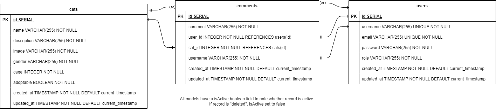

# TheShelterPeople_sg

Animal Shelter Website for TheShelterPeople.

Even though the volunteer group has since been disbanded as of 2023, I keep this website up as a reminder of the cats.

<!-- Visit the website here: https://theshelterpeople-sg.herokuapp.com/ -->

## Description

This Animal Shelter website was refined from the prototype that was created for a project.

_Extremely big_ special shout out to my wonderful group mates (They the MVPs!!), without whom this website would not be possible! Check out the prototype's github [here.](https://github.com/soniasltan/Project-3---The-Shelter-People)



Accessibility check done using [GovTech's purple hat](https://www.developer.tech.gov.sg/products/categories/design/purple-hats/overview). Adjustments made on a at best effort basis.


# Changelog

Format based on [Keep a Changelog](https://keepachangelog.com/en/1.0.0/),

## [Unreleased]

## [2.0.0] - Sep 2023

### Changed

- Cage 6/7 will be set to cage 6 as cage is now defined as integer
- Improved selection list for updating cat details
- Changed map provider from Google Maps to Leaflet Maps
- Upgraded client libraries to latest version

### Added

- Backend change: User controller to include read and update
- Backend change: Comment controller to include get comment by cat ID due to change from MongoDB to PostgreSQL

### Deprecated

- Heroku deployment in favour of xxx (see above)

## [1.1.0] - 9 Dec 2021

### Added

- Signup update: checks if username/email exists before creating user

### Changed

- React router upgraded to v6
- Adoptable cats and Unadoptable cats are separated
- Styling changes: Edited CSS for better view on devices

###### Planning

```
4 Sep 2023 - Reading up on PERN stack
Reading on changes to be made from MERN to PERN
Looking at current data structure and changes to be made
Will need to relook at the whole project again

5 Sep 2023 - Planning for changes.

Plans for changes:
-[x] 1. Draw data diagram
-[x] 2. Set up new postgres database
-[x] 3. Change models
-[x] 4. Change controllers
-[x] 5. Test API with postman
-[x] 6. Migrate data from mongoDB to postgres
-[x] 7. Test after migration
-[x] 8. Adjust frontend to new API
-[x] 9. Refine frontend
-[x] 10. Check routing
-[x] 11. Adjust models and controllers for deactivation
-[x] 12. Test after deactivation adjustments
-[ ] 13. Look at hosting options

Sketch data diagram.
Set up pg database and models.

6 Sep 2023 - Added ERD diagram.

7 Sep 2023 - Installed pg library.
Read up on pg website.
Adjust cat controller.

8 Sep 2023 - Adjust user controller.

9 Sep 2023 - Added read and update to user controller.
Adjust comment controller.
Added get comment by cat ID to comment controller.

10 Sep 2023 - Adjust session controller.
Set username and email in user model to unique.
Adjust server.js

11 Sep 2023 - Test users API on postman.
Test session API on postman.
Test cats API on postman.
Test comments API on postman.

12 Sep 2023 - Migrate data from mongoDB to postgres.
Adjusting frontend after migration.

13 Sep 2023 - Adjusting frontend after migration.
Need to adjust comment portion due to changes in schema.

14 Sep 2023 - Refining frontend.
Change react google maps to leaflet maps.
Updated client (frontend) dependencies to latest version

15 Sep 2023 - Remove redundancies.
Added error handling.

16 Sep 2023 - Uninstalled unnecessary dependencies.
Adjusted ERD.

18 Sep 2023 - Adjusted routing and navigation.

19 Sep 2023 - Adjusted models for deactivation.
Adjusted controllers for deactivation.

20 Sep 2023 - Test after deactivation adjustments.

21 Sep 2023 - Read up on hosting options.

24 Sep 2023 - Sort out some cats.
Run purple hat to check website accessibility.
Adjusted styling based on report.

26 Sep 2023 - Setting up hosting

27 Sep 2023 - Setting up hosting

29 Sep 2023 - Setting up hosting

2 Oct 2023 - Setting up hosting, added ssl true to pg pool.
Changed bcrypt to bcryptjs.
```
